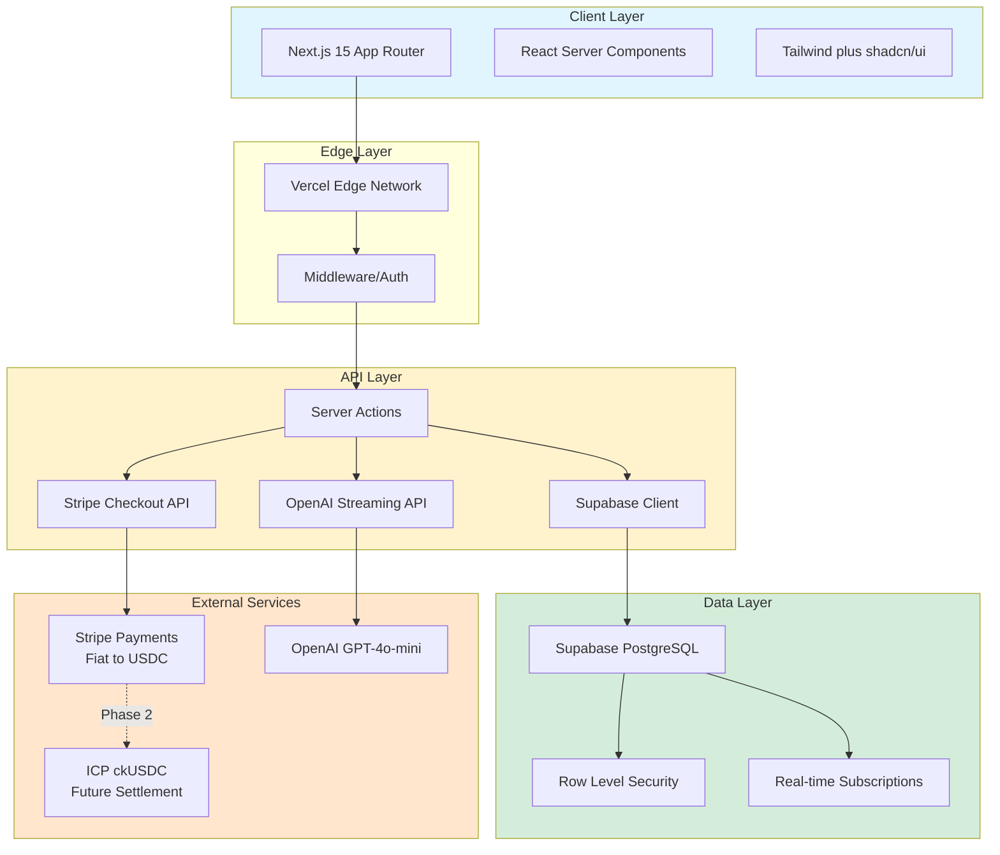

``mermaid
 flowchart TD
    Start((Open Momentum)) --> Welcome{First Time?}
    
    Welcome -- Yes --> Boost[Claim 2x Multiplier Welcome Boost]
    Welcome -- No --> Mirror[<b>The Mirror:</b> What are you avoiding?]
    
    Boost --> Mirror
    
    Mirror --> AI[AI Task Shredder: GPT-4o-mini]
    AI --> Steps[5-Minute Micro-Steps Generated]
    
    Steps --> Select[Select Daily Habits: Mind/Body/Spirit]
    
    Select --> Stake{Stake Momentum?}
    Stake -- No --> Browse[Browse Only Mode]
    Stake -- Yes --> Payment[Stripe / ckUSDC Stablecoin Stake]
    
    Payment --> Daily[Daily Check-in Loop]
    
    Daily --> Verify{Goal Met?}
    Verify -- Yes --> Progress[Maintain Streak + Raffle Entry]
    Verify -- No --> Loss[Stake Released to Prize Pool]
    
    Progress --> Weekly[Weekly Caffeine Raffle]
    Weekly --> Monthly[Monthly $20 Streak Prize]
```


