# 🌊 Momentum

**Destroy procrastination. Stake on yourself. Win by doing.**

Momentum is a high-stakes habit formation platform that combines **behavioral psychology** (loss aversion) with **AI task decomposition** to destroy the friction of starting. Unlike traditional trackers that guilt you into compliance, Momentum targets the moment of avoidance and turns it into momentum.

> *"The secret of getting ahead is getting started. The secret of getting started is breaking your complex overwhelming tasks into small, manageable tasks, and then starting on the first one."* — Mark Twain (adapted)

---

## 🎯 The Problem

Traditional productivity tools fail because they:
- **Create anxiety** with endless to-do lists
- **Feel like chores** with rigid habit tracking
- **Ignore the root cause**: the overwhelming moment before starting

**Starting is the hardest part.** Momentum fixes this by attacking the "activation energy" barrier directly.

---

## 💡 The Solution: The Anti-Procrastination Mirror

### 1. The Mirror (AI Task Shredder)
Tell the app what you're avoiding right now. Our AI breaks it into **five 5-minute micro-steps** with zero friction. No decisions, no preparation—just immediate action.

### 2. The Stake (Loss Aversion Engine)
Bet **$1+ weekly** on yourself using USDC/stablecoins. Higher stakes = more raffle tickets. Miss your goals → lose your stake. Complete them → full refund + prize pool entry.

### 3. The Loop (Habit Replacement)
Fill the void of bad habits (doomscrolling, snoozing) with **30+ free micro-achievements** across Mind, Body, and Spirit. Zero cost, zero equipment.

### 4. The Reward (Weighted Raffle)
Complete weekly goals to enter raffles for:
- **Weekly**: $100 Caffeine Credits
- **Monthly**: $20+ Cash Prize (4-week streak holders)

---

## 🚀 Core User Flow


________________

# 🌊 Momentum: The Anti-Procrastination Mirror

**Stop Avoiding. Start Flowing.** *Destroy procrastination. Stake on yourself. Win by doing.*

Momentum is a high-stakes accountability platform that transforms the "anxiety of starting" into micro-wins. Using behavioral psychology (loss aversion) and AI-driven task decomposition, Momentum helps you crush procrastination while building a "New You" through Mind, Body, and Spirit habits.

## 🎯 The Hook
Traditional to-do lists create anxiety. **Momentum** targets the friction of starting by asking one simple question: *"What are you avoiding right now?"*

---

## 🚀 How It Works

1.  **The Mirror:** Tell the AI what you're avoiding. It uses GPT-4o-mini to shred that scary task into **5-minute micro-steps**.
2.  **The Habit Grid:** Select from 30+ free habits (Touch grass, 3-min meditation, no-doomscrolling) to fill your day with positive momentum.
3.  **The Stake:** Put "Skin in the Game." Stake $1+ (via Stripe/USDC) on your weekly success. 
4.  **The Raffle:** Success keeps your money and enters you into the **Weekly Caffeine Raffle** and the **Monthly $20 Streak Prize**.

---

## 🛠 Tech Stack

- **Framework:** Next.js 15 (App Router) + TypeScript
- **Styling:** Tailwind CSS + shadcn/ui
- **Backend/Auth:** Supabase (PostgreSQL + Auth)
- **AI Engine:** Vercel AI SDK + OpenAI GPT-4o-mini
- **Web3/Stablecoin:** ICP Canisters (ckUSDC / ckUSDT) for transparent prize pools.
- **Payments:** Stripe (Fiat-to-Stablecoin onramp)
- **Incentives:** Caffeine.ai integration for reward distribution.

---

## 📦 Core Features

### 🧠 Mind, Body, Spirit Library (30+ Habits)
- **Mind:** 3-min meditation, 5 pages of reading, 4-7-8 breathing.
- **Body:** Stretch arms, 10 squats, splash cold water, drink 500ml water.
- **Spirit:** Hug a tree, touch grass, say good morning to 3 people, gratitude log.

### 🚫 The Avoidance List (The "Anti-Habits")
Track and quit: Snoozing the alarm, excess doomscrolling, caffeine after 3 PM, and more.

### 💸 The Financial Engine
- **Weekly Lockups:** Stake USDT/USDC to prove your commitment.
- **Weighted Raffles:** Higher stakes + more tasks = higher probability of winning.
- **Welcome Boost:** New users claim a **2x Win Multiplier** for their first week.

### 👥 Group Pulses
Anonymous pods of 3-5 people for social accountability without the noise of social media.

---

## 🏗 Project Structure


_________________________


________

## 🚀 Core User Flow




```mermaid
flowchart TD
    A[User opens app] --> B{First time?}
    B -->|Yes| C[Claim Welcome Boost 2x]
    B -->|No| D[Morning Check-in]
    
    C --> D
    
    D --> E[What are you avoiding?]
    E --> F[AI generates 5 micro-steps]
    F --> G[Select 3+ habits<br/>Mind/Body/Spirit]
    
    G --> H{Staked this week?}
    H -->|No| I[Stake $1+ USDC<br/>via Stripe]
    H -->|Yes| J[Daily Dashboard]
    I --> J
    
    J --> K[Complete micro-steps<br/>& habits throughout day]
    K --> L{Week end?}
    L -->|No| J
    L -->|Yes| M{Goals met?}
    
    M -->|Yes| N[Refund stake<br/>+ Raffle tickets<br/>= habits × stake × multiplier]
    M -->|No| O[Forfeit to prize pool]
    
    N --> P[Weekly Raffle<br/>Win Caffeine Credits<br/>or Cash]
    O --> Q[Try again next week<br/>Streak reset]
    
    P --> R[New Week<br/>Streak bonus +10%]
    Q --> R
    R --> D
    
    style A fill:#e1f5ff
    style N fill:#d4edda
    style O fill:#f8d7da
    style P fill:#fff3cd
```

_____


_________


``` mermaid
/momentum
├── app/
│   ├── api/shred/route.ts     # AI Task Decomposition
│   ├── api/webhooks/stripe    # Stablecoin staking logic
│   ├── dashboard/             # Main Checklist & Mirror UI
│   └── raffle/                # Winners & Rankings
├── components/
│   ├── mirror/                # AI Input & Step display
│   ├── habits/                # Checklist & Progress rings
│   └── staking/               # Stripe/ICP Integration
├── lib/
│   ├── supabase/              # DB Clients
│   └── habits-data.ts         # Library of 30+ items
└── supabase/
    └── schema.sql             # Users, Stakes, Logs
```


______________


``` mermaid
flowchart TD
    A[User opens app] --> B{First time?}
    B -->|Yes| C[Claim Welcome Boost 2x]
    B -->|No| D[Morning Check-in]
    
    C --> D
    
    D --> E[What are you avoiding?]
    E --> F[AI generates 5 micro-steps]
    F --> G[Select 3+ habits<br/>Mind/Body/Spirit]
    
    G --> H{Staked this week?}
    H -->|No| I[Stake $1+ USDC<br/>via Stripe]
    H -->|Yes| J[Daily Dashboard]
    I --> J
    
    J --> K[Complete micro-steps<br/>& habits throughout day]
    K --> L{Week end?}
    L -->|No| J
    L -->|Yes| M{Goals met?}
    
    M -->|Yes| N[Refund stake<br/>+ Raffle tickets<br/>= habits × stake × multiplier]
    M -->|No| O[Forfeit to prize pool]
    
    N --> P[Weekly Raffle<br/>Win Caffeine Credits<br/>or Cash]
    O --> Q[Try again next week<br/>Streak reset]
    
    P --> R[New Week<br/>Streak bonus +10%]
    Q --> R
    R --> D
    
    style A fill:#e1f5ff
    style N fill:#d4edda
    style O fill:#f8d7da
    style P fill:#fff3cd
```


___________


